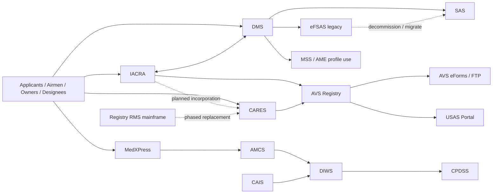

# FAA Certification and Registry Portfolio Research Report

## Executive summary

This report reviews the public-facing certification and registry portfolio operated by the entity["organization","Federal Aviation Administration","us aviation regulator"] under the entity["organization","U.S. Department of Transportation","us cabinet department"], focusing on Registry Modernization System and AVS Registry, IACRA, MedXPress and the Medical Support System stack, and the Designee Management System. The strongest public modernization signal is the aircraft registry stack: FAA publicly states that registry RMS was last updated in 2008, runs on a costly mainframe, and is being replaced in phases by CARES. IACRA is functionally mature but still separate from the final registry record and is publicly described as a front-end that will eventually be incorporated into CARES. MedXPress/MSS is less obviously legacy at the user interface level, but its public PIAs expose a fragmented back end with MedXPress, AMCS, DIWS, CPDSS, and CHAPS. DMS appears to be under active modernization rather than neglect, with Login.gov migration, public release notices, and DMS 8.x policy deviations indicating continuing investment. citeturn28view2turn38view0turn37search12turn10view3turn6search1turn6search6

The portfolio is still highly document-centric. Public materials point to scanned images, PDF/TIFF viewers, uploaded supporting documents, file-transfer and replication style integrations, and role-based workflow queues rather than API-first service boundaries. Across the portfolio, there is also clear identity sprawl: IACRA supports local accounts plus PIV/MyAccess for FAA users; CARES uses MyAccess identity proofing; MedXPress uses its own account model; and AMCS/DMS moved non-FAA users to entity["organization","Login.gov","us digital identity service"] in 2025 while FAA personnel remain on PIV-backed internal access. citeturn31search3turn29view0turn20view2turn21view2turn34view1

My working assumption is conservative: I only infer internal interfaces, stack clues, and rationalization opportunities where a public PIA, help page, manual, notice, form, search page, URL pattern, or release note explicitly names a dependency or reveals a technical behavior. I did not assume hidden endpoints, non-public contracts, or undocumented interfaces.

## Portfolio-level findings

The public architecture looks like four partially overlapping product lines sharing users, identifiers, and back-end records rather than one coherent platform. IACRA is the airmen application front-end and temporary repository before acceptance into the official airmen record in the AVS Registry. MedXPress starts the medical application, then AMCS handles the exam, DIWS becomes the image/archive and workflow system, and CPDSS handles covered-position clearance. DMS runs the designee lifecycle and practical-test oversight, pulling from IACRA and sending data to MSS, SAS, and older flight standards systems. The aircraft side of AVS Registry still preserves paper-mail, scan, and examiner workflows even while CARES adds web submission. citeturn4search6turn19view0turn22view1turn34view0turn38view0

The most important cross-system integration clues are explicit and public: AVS Registry exchanges with USAS and AVS eForms via FTP; DMS exchanges with IACRA, MSS, NACIP, SAS, and eFSAS; MSS exchanges with CAIS, DMS, Investigation Tracking/NDR workflows, Aviator, and directory services; and FAA program notices show eFSAS functions migrating into SAS while PRD references CAIS and formerly eFSAS as upstream sources. citeturn39view1turn39view4turn34view0turn22view4turn22view5turn22view3turn12search2turn12search6turn9search8

The public-facing technical clues skew toward classic ASP.NET/web-form style estates. Examples include IACRA pages ending in `.aspx`, MedXPress account/help URLs ending in `.aspx`, and manuals that discuss PDF/TIFF viewers, summary sheets, generated PDFs, uploaded documents, and password-based or PIV/MyAccess-based sessions. Where newer modernization appears, it shows up as identity federation, new portals, HTML5 mention in SAS materials, and phased platform replacement rather than as public REST APIs. Targeted searches of the FAA API portal did not surface product-specific public APIs for these systems; the public interfaces are portals, guides, forms, search tools, and downloadable datasets. citeturn31search3turn14view0turn8search8turn7search1turn16view4turn26search0turn12search7

The following diagram reflects the public integration picture and the modernization direction implied by PIAs, manuals, and notices. citeturn34view0turn22view1turn39view1turn37search12turn12search8

## Registry Modernization System and AVS Registry

Publicly, the AVS Registry is now described in two ways: as the official airmen record within the Airmen Certification System and as the Aircraft Registration System or Aircraft Registry for aircraft records. On the aircraft side, the current PIA documents a still largely paper-centered part 47 process, while the 2025 Federal Register rule states that legacy RMS was last updated in 2008, runs on a mainframe, and is being modernized through CARES under congressional direction. That makes this the clearest “highest-priority rationalization” target in the portfolio. citeturn38view0turn28view2

**Public artifacts and direct links**

- Aircraft Registration System PIA 2025 — [https://www.transportation.gov/sites/dot.gov/files/2025-08/Privacy%20-%20FAA%20-%20Aircraft%20Registration%20System%20-%20PIA%20-%202025.pdf](https://www.transportation.gov/sites/dot.gov/files/2025-08/Privacy%20-%20FAA%20-%20Aircraft%20Registration%20System%20-%20PIA%20-%202025.pdf) — current canonical source for aircraft-registry data elements, workflow, retention, and USAS/eForms exchanges. citeturn38view0
- Aircraft Registration privacy page — [https://www.transportation.gov/resources/individuals/privacy/aircraft-registration-system](https://www.transportation.gov/resources/individuals/privacy/aircraft-registration-system) — concise summary page linking the current aircraft-registry privacy posture and naming the USAS exchange. citeturn38view1
- Airmen/Aircraft RMS PIA 2004 — [https://www.transportation.gov/individuals/privacy/pia-airmenaircraft-registry-modernization-system](https://www.transportation.gov/individuals/privacy/pia-airmenaircraft-registry-modernization-system) — useful legacy baseline showing RMS as an internal record-management and safety-analysis tool and exposing older public airmen-service access patterns. citeturn10view0
- Federal Register procedural update 2025 — [https://www.federalregister.gov/documents/2025/01/17/2025-00763/aircraft-registration-and-recordation-procedural-updates-original-documents-and-stamping](https://www.federalregister.gov/documents/2025/01/17/2025-00763/aircraft-registration-and-recordation-procedural-updates-original-documents-and-stamping) — strongest public modernization signal for RMS/CARES transition. citeturn28view2
- CARES home — [https://cares.faa.gov/](https://cares.faa.gov/) — current replacement-facing portal for selected registry services. citeturn4search3
- CARES program page — [https://www.faa.gov/about/initiatives/cares](https://www.faa.gov/about/initiatives/cares) — enumerates current online services and confirms phased rollout. citeturn4search5
- CARES user-guide page — [https://www.faa.gov/cares/user_guide](https://www.faa.gov/cares/user_guide) — public artifact landing page. citeturn28view3
- CARES sign-up guide — [https://www.faa.gov/sites/faa.gov/files/CARES%20Sign%20Up%20for%20Individual%20Account%20Instructions.pdf](https://www.faa.gov/sites/faa.gov/files/CARES%20Sign%20Up%20for%20Individual%20Account%20Instructions.pdf) — public identity-proofing and onboarding guide. citeturn29view0
- Aircraft registration forms page — [https://www.faa.gov/licenses_certificates/aircraft_certification/aircraft_registry/aircraft_regn_forms](https://www.faa.gov/licenses_certificates/aircraft_certification/aircraft_registry/aircraft_regn_forms) — public forms inventory for aircraft-registry work. citeturn27search9
- AC Form 8050-1 info page — [https://www.faa.gov/forms/index.cfm/go/document.information/documentid/185220](https://www.faa.gov/forms/index.cfm/go/document.information/documentid/185220) — source page for the core registration application. citeturn27search12
- AC Form 8050-1 PDF — [https://www.faa.gov/documentLibrary/media/Form/AC_Form_8050-1_revised_04-2024_PA.pdf](https://www.faa.gov/documentLibrary/media/Form/AC_Form_8050-1_revised_04-2024_PA.pdf) — public source form. citeturn27search18
- Airmen Services login — [https://amsrvs.registry.faa.gov/amsrvs/](https://amsrvs.registry.faa.gov/amsrvs/) — public airmen side of registry services. citeturn29view4
- Replacement certificate service — [https://amsrvs.registry.faa.gov/amsrvs/Service/ReplacementNotice](https://amsrvs.registry.faa.gov/amsrvs/Service/ReplacementNotice) — public transaction page and CAIS clue. citeturn29view3
- Change certificate number page — [https://www.faa.gov/licenses_certificates/airmen_certification/change_certificate_number](https://www.faa.gov/licenses_certificates/airmen_certification/change_certificate_number) — public service page tied to registry updates. citeturn27search5
- AC 8060-67 form page — [https://www.faa.gov/forms/index.cfm/go/document.information/documentid/186614](https://www.faa.gov/forms/index.cfm/go/document.information/documentid/186614) — change-certificate-number form. citeturn27search3
- AC 8060-55 / 56 / 68 / 69 form pages — [Change of Address](https://www.faa.gov/forms/index.cfm/go/document.information/documentID/183711), [Replacement Certificate](https://www.faa.gov/forms/index.cfm/go/document.information/documentID/183832), [Airman File Request](https://www.faa.gov/forms/index.cfm/go/document.information/documentid/186615), [Third-Party Release](https://www.faa.gov/forms/index.cfm/go/document.information/documentID/186616). citeturn30search1turn30search0turn30search2turn30search3

**Data elements and document/image types**

The 2025 aircraft-registry PIA lists owner full name, address, phone number, email address, citizenship/residency attestation, N-number, and aircraft manufacturer, model, and serial number as core collected fields. It also identifies legal supporting records such as bills of sale, court orders, and divorce decrees. Operationally, received items are classified by type — including envelope, application, evidence of ownership, correspondence, and security or lease agreement — and scanned front and back into a work packet. The digital images become the official legal record; the paper is retained only through quality review and then destroyed under retention policy. citeturn39view3turn38view0

On the airmen side, public pages show registry-backed services for address changes, SSN removal as certificate number, replacement certificates, temporary authority requests, and verification of privileges. The replacement-certificate page explicitly names the Comprehensive Airmen Information System as the system performing edits against the user’s record, which is a useful public clue that CAIS still exists as a named registry-side subsystem. Public Airmen Inquiry is also called out in the 2025 Airmen Certification PIA as the surface that exposes selected certificate and rating information. citeturn29view4turn29view3turn3view5

**Documented workflows, roles, and transitions**

The aircraft-registration workflow is still classic queue processing. The owner completes AC 8050-1, supplies proof of ownership and fee, and mails the package. The branch time-stamps it, scans it, forms a work packet, and routes it to examiners. If the package is deficient, FAA sends a corrective letter; if complete, the scanned images are annotated with a dated file notation, transferred into the permanent aircraft record, and a registration certificate is mailed. Renewals run on a seven-year cadence and can be done by paper or on the renewal site using N-number plus a unique security code from the expiration notice. citeturn39view3

CARES changes only part of that picture. FAA says CARES permits secure online submission, document upload, notifications, N-number services, and payments, but the 2024 CARES PIA still states that review of electronic and PDF applications was, at that time, being managed in the AVS Registry. That implies a hybrid state: new intake surface, old adjudication core. citeturn4search5turn10view1

**Public integration surfaces, likely internal interfaces, tech clues, and APIs**

The strongest public integration clues are explicit: AVS Registry provided a one-time aircraft-record exchange to the USAS Portal using name, email address, N-number, and serial number; AVS eForms sends completed Form 337 data through an FTP server; the renewal workflow depends on pay.gov for payment; and applicants can verify upload/receipt through Aircraft Inquiry tools and downloadable database/index surfaces. The 2025 Federal Register notice separately states that RMS was a mainframe environment, last updated in 2008, and that CARES is the web-based modernization path. citeturn39view1turn39view4turn39view3turn28view2

I did not find a product-specific public API for RMS/AVS Registry. The public surface is portals, forms, search pages, inquiry tools, downloadable data, and help content rather than documented developer APIs. That is consistent with a registry/document-imaging architecture, not an external API program. citeturn26search0turn29view4turn27search9

**Modernization signals and rationalization opportunities**

RMS/AVS Registry should be treated as the top portfolio rationalization priority. The public evidence points to a legacy mainframe, paper-first workflows, a separate CARES intake layer, and form/image-based integration. The most valuable target-state move is to make CARES or its successor the only intake system, with one canonical registry document service, one payment abstraction, one inquiry layer, and one registry case/workflow engine. The public materials also suggest an immediate intermediate step: end duplicate user journeys across CARES, Airmen Services, and legacy renewal/search pages by consolidating “simple self-service registry updates” first. citeturn28view2turn10view1turn29view4

## IACRA

IACRA is publicly documented as the web-based airman certification and rating application that guides users through the certification process and electronically forwards the application and test results to the Airman Registry. Public privacy materials describe it as the front-end and temporary repository, with the official airmen record remaining in the AVS Registry. There is also an explicit public note that IACRA will be incorporated into CARES once CARES is fully implemented. That combination makes IACRA a strong “consolidate but do not cold-rewrite blindly” candidate. citeturn31search2turn4search6turn37search12

**Public artifacts and direct links**

- IACRA home — [https://iacra.faa.gov/](https://iacra.faa.gov/) — public entry point. citeturn9search4
- Training and documentation page — [https://iacra.faa.gov/iacra/traininganddocs.aspx](https://iacra.faa.gov/iacra/traininganddocs.aspx) — launch point for the training site and consolidated guide. citeturn14view0
- Consolidated IACRA User Guide PDF — [https://iacratraining.faa.gov/IACRA/PDFFiles/IACRA%20User%20Guide.pdf](https://iacratraining.faa.gov/IACRA/PDFFiles/IACRA%20User%20Guide.pdf) — 210-page primary artifact for roles, data fields, application paths, RI/CO checklists, and practical-test processing. citeturn15view0
- Legacy full instruction manual — [https://iacra.faa.gov/iacra_manuals/IACRA_Instruction_Manual_full.pdf](https://iacra.faa.gov/iacra_manuals/IACRA_Instruction_Manual_full.pdf) — older but still revealing for architecture and document-viewer behavior. citeturn13search0
- What’s new / release notes — [https://iacra.faa.gov/iacra/newsevents.aspx](https://iacra.faa.gov/iacra/newsevents.aspx) — public release stream. citeturn31search0
- FAQ — [https://iacra.faa.gov/iacra/faq.aspx](https://iacra.faa.gov/iacra/faq.aspx) — direct statement of what IACRA does and how correction/upload flows work. citeturn31search2
- MyAccess/PIV guidance — [https://iacra.faa.gov/iacra/helpandinfo.aspx?id=1](https://iacra.faa.gov/iacra/helpandinfo.aspx?id=1) — FAA-user authentication guidance. citeturn31search3
- New user guide — [https://iacra.faa.gov/iacra/HelpandInfo.aspx?id=5](https://iacra.faa.gov/iacra/HelpandInfo.aspx?id=5) — basic applicant onboarding page. citeturn13search1
- Student pilot guide — [https://iacra.faa.gov/IACRA/HelpandInfo.aspx?id=6](https://iacra.faa.gov/IACRA/HelpandInfo.aspx?id=6) — public process guide for student pilot flow. citeturn13search5
- Remote pilot with knowledge test — [https://iacra.faa.gov/iacra/HelpandInfo.aspx?id=7](https://iacra.faa.gov/iacra/HelpandInfo.aspx?id=7). citeturn13search8
- Remote pilot with training course — [https://iacra.faa.gov/iacra/HelpandInfo.aspx?id=8](https://iacra.faa.gov/iacra/HelpandInfo.aspx?id=8). citeturn13search10
- Inspection authorization renewal help — [https://iacra.faa.gov/IACRA/HelpAndInfo.aspx?id=9](https://iacra.faa.gov/IACRA/HelpAndInfo.aspx?id=9). citeturn13search11
- Outage/help page — [https://iacra.faa.gov/IACRA/helpandinfo.aspx?id=12](https://iacra.faa.gov/IACRA/helpandinfo.aspx?id=12) — useful resilience/operational artifact. citeturn31search1
- IA renewal training PDF — [https://iacratraining.faa.gov/IACRA/PDFFiles/IACRA%20IA%20Renewal%20Applicant_2023.pdf](https://iacratraining.faa.gov/IACRA/PDFFiles/IACRA%20IA%20Renewal%20Applicant_2023.pdf) — public training artifact for a newer path. citeturn13search9

**Extracted data elements, field names, and document/image types**

IACRA’s public user guide exposes a detailed profile model: certificate number and date of issuance; first, middle, last, and suffix; SSN optional; date of birth; sex; hair and eye color; height and weight; phone; unique email; citizenship; city and county of birth; security question and answer; and role-related organization selections. The applicant console also exposes FTN, username, and current role. Application blocks include certificate sought, certificates held, medical certificate, drug convictions, English-language information, failures or disapprovals, category/class ratings, type ratings, aeronautical experience, foreign pilot license details, air operator or training center details, and summary/review sections. citeturn17view1turn16view2turn17view2turn17view3turn16view5

The product is also visibly document-oriented. The manuals describe a default document viewer that can be set to TIFF or PDF, generated application copies that can be saved as TIFF or viewed/printed as PDF, and correction flows where a certifying officer uploads a corrected application package back to the registry. That is a strong clue that the underlying document model remains image/PDF-centric. citeturn16view4turn31search2

**Documented workflows, roles, and state transitions**

IACRA’s role model is explicit and important. Public manuals list at least Applicant, Recommending Instructor, Designated Examiner, ASI/AST, and School Administrator roles, with different authorization scopes validated against FAA databases. Applicants can start, continue, delete, or view/print applications until workflow milestones lock editing. Once submitted, the RI checklist can review, annotate, upload documents, or return the application for correction. The CO side can record practical-test outcomes as approve, disapprove, discontinue, or delete, with reason capture for discontinuance and failure-task selection for disapproval. citeturn17view0turn18view4turn17view4turn18view0turn18view1

Public help and outage material adds useful operational state clues. The outage page confirms that FTNs, user-profile updates, initiated-but-unsubmitted applications, and status display can all be affected by recovery events, while approved/submitted applications may recover directly to Registry even if the IACRA UI no longer reflects them. Release notes show an active version stream and ongoing business-rule changes such as IA renewal activation, CFI recency updates, ACS display changes, practical-test workflow changes, and PTRS generation fixes. citeturn31search1turn31search0

**Public integration surfaces, likely internal interfaces, tech clues, and APIs**

The public FAQ says IACRA interfaces with multiple FAA national databases to validate data, applies business rules, uses digital signatures, and automatically forwards the application and test results to the Airman Registry. The user guide separately describes web-based architecture accessible via the internet and validation against “various FAA databases.” FAA employees can use PIV/MyAccess when their FAA email is in the profile; other users continue with the standard login model. Public release notes also reveal cross-links to PTRS record generation, aircraft search, knowledge-test association, and certifying-officer checklist flows. citeturn31search2turn17view0turn31search3turn31search0

I found no public IACRA API documentation. The public surface area is entirely portal-, role-, and document-based: help pages, training site PDFs, release notes, and interactive workflows. Given the public plan to fold IACRA into CARES eventually, the rationalization opportunity is not to re-platform the UI first; it is to separate reusable domain services from legacy page flows and converge the identity, document, and case-state models with the registry modernization program. citeturn37search12turn14view0turn26search0

## MedXPress and Medical Support Systems

Public sources show MedXPress is only the visible tip of a larger medical stack. The current MSS PIA covers MedXPress, AMCS, CPDSS, DIWS, and CHAPS, with no PIA needed for DSS because it does not contain PII. This is a materially richer public disclosure set than most government systems, and it reveals a layered application, imaging, and workflow estate rather than a single end-to-end product. citeturn10view3turn19view1

**Public artifacts and direct links**

- MedXPress home — [https://medxpress.faa.gov/](https://medxpress.faa.gov/) — public entry point. citeturn7search4
- MedXPress user guide — [https://medxpress.faa.gov/medxpress/Content/Docs/MedXPressUsersGuide.pdf](https://medxpress.faa.gov/medxpress/Content/Docs/MedXPressUsersGuide.pdf) — primary applicant workflow artifact. citeturn7search7
- MedXPress FAQ — [https://medxpress.faa.gov/medxpress/Help/FAQ.htm](https://medxpress.faa.gov/medxpress/Help/FAQ.htm). citeturn8search15
- MedXPress instructions page — [https://medxpress.faa.gov/MedXPress/Help/Instructions.htm](https://medxpress.faa.gov/MedXPress/Help/Instructions.htm) — direct item-by-item 8500-8 instructions. citeturn8search10
- MedXPress contact/release page — [https://medxpress.faa.gov/medxpress/Help/ContactUs.aspx](https://medxpress.faa.gov/medxpress/Help/ContactUs.aspx) — reveals public release number and live help channels. citeturn7search1
- MSS PIA 2025 — [https://www.transportation.gov/sites/dot.gov/files/2025-07/Privacy%20-%20MSS%20-%20PIA%20-%202025.pdf](https://www.transportation.gov/sites/dot.gov/files/2025-07/Privacy%20-%20MSS%20-%20PIA%20-%202025.pdf) — canonical system-of-systems source. citeturn10view3
- AMCS support page — [https://www.faa.gov/other_visit/aviation_industry/designees_delegations/designee_types/ame/amcs](https://www.faa.gov/other_visit/aviation_industry/designees_delegations/designee_types/ame/amcs). citeturn8search5
- AMCS user guide — [https://www.faa.gov/other_visit/aviation_industry/designees_delegations/designee_types/ame/amcs/media/AMCS_User_Guide.pdf](https://www.faa.gov/other_visit/aviation_industry/designees_delegations/designee_types/ame/amcs/media/AMCS_User_Guide.pdf). citeturn7search10
- AMCS document upload quick-start guide — [https://www.faa.gov/other_visit/aviation_industry/designees_delegations/designee_types/ame/amcs/media/AMCS_Document_Upload_Quick_Start_Guide.pdf](https://www.faa.gov/other_visit/aviation_industry/designees_delegations/designee_types/ame/amcs/media/AMCS_Document_Upload_Quick_Start_Guide.pdf). citeturn21view0
- AMCS document type list — [https://www.faa.gov/other_visit/aviation_industry/designees_delegations/designee_types/ame/amcs/media/AMCS_DocumentTypes.pdf](https://www.faa.gov/other_visit/aviation_industry/designees_delegations/designee_types/ame/amcs/media/AMCS_DocumentTypes.pdf). citeturn21view1
- MFA/Login.gov transition sheet — [https://www.faa.gov/other_visit/aviation_industry/designees_delegations/designee_types/ame/amcs/media/MFA_Transition_to_Login-gov.pdf](https://www.faa.gov/other_visit/aviation_industry/designees_delegations/designee_types/ame/amcs/media/MFA_Transition_to_Login-gov.pdf). citeturn21view2
- AME processing guide for MedXPress — [https://www.faa.gov/sites/faa.gov/files/other_visit/aviation_industry/designees_delegations/designee_types/MedXPress%20AME%20Procedures_Jan%202012.pdf](https://www.faa.gov/sites/faa.gov/files/other_visit/aviation_industry/designees_delegations/designee_types/MedXPress%20AME%20Procedures_Jan%202012.pdf). citeturn21view3
- AME Guide landing page / PDF — [https://www.faa.gov/ame_guide](https://www.faa.gov/ame_guide) and [https://www.faa.gov/ame_guide/media/ame_guide.pdf](https://www.faa.gov/ame_guide/media/ame_guide.pdf). citeturn7search8turn7search2

**Extracted data elements, field names, and document/image types**

MedXPress publicly breaks Form 8500-8 into sections for General, Demographics, Prior Certification, Medication, Medical History, Medical Visits, and Declarations. The appendix-level instructions list the numbered field semantics: application type, class applied for, full name, SSN, address, DOB/citizenship, hair color, eye color, sex, certificate type held, occupation, employer, prior denial or suspension, total pilot time, recent pilot time, last FAA medical exam, medications, medical history, visits to health professionals, and the National Driver Register/certifying declaration. The current MSS PIA adds the broader PII set: pseudo-SSN, phone numbers, applicant ID, confirmation number, IP address, MID, arrest history, and security-question answers. citeturn20view5turn24view0turn25view0turn20view0

AMCS adds the examination layer: height and weight, SODA information, body-system findings, vision and hearing measures, blood pressure and pulse, urine test, ECG results, comments, an issuance/denial/deferment decision, reasons for denial, and AME or flight-surgeon certification. The AMCS document-upload guide and 2026 document-type list reveal a surprisingly rich document taxonomy: ECGs, IDs, lab reports, discharge summaries, narratives, psychiatric evaluations, CogScreen tests, cardiac test reports and tracings, court documents, correspondence, and many other specialty categories. Upload constraints are also public: up to 25 documents per exam, 3 MB each, with accepted formats PDF, DOC, DOCX, JPG, JPEG, and XPS. citeturn19view2turn20view0turn21view0turn21view1

**Documented workflows, roles, and state transitions**

The user-facing MedXPress workflow is straightforward and fully documented: create an account, answer three security questions, accept the Privacy Act statement, select exam reason, accept the Pilot’s Bill of Rights when applicable, fill out 8500-8, submit, print the summary sheet, and bring the confirmation number to the AME. Once submitted, the applicant cannot edit the application. Public status values include No Application Submitted, Submitted, Imported, Transmitted, In Review, Action Required, Medical Certificate Issued, Denial/Disqualification/Withdrawal, and Final Review. Additional document and correspondence lists become available in later FAA-review states. citeturn23view0turn20view2turn23view2turn23view3turn23view4

The downstream workflow is equally explicit. MedXPress submits into AMCS; AME or FAA Flight Surgeon logs in, imports by confirmation number, completes the rest of 8500-8, and either issues, denies, or defers. AMCS then transmits the completed exam into DIWS. DIWS becomes the internal archive and queue manager, routing approvals, denials, deferrals, anomaly checks, and internal reviews across CAMI, regional flight-surgeon offices, and headquarters. CPDSS then handles ATCS/covered-position clearance decisions as an internal interface layered on DIWS. citeturn19view2turn22view1turn22view2

**Public integration surfaces, likely internal interfaces, tech clues, and APIs**

This stack exposes the richest public integration map in the portfolio. MSS PIAs say DIWS receives data from AVS Registry CAIS; DIWS transmits encrypted files to an Investigation Tracking System used to compare recent medical certifications against the National Driving Record; DIWS sends AME performance-report data to DMS; DMS returns AME profile data to MSS; CPDSS sends selected ATCS onboarding fields to Aviator; and MSS consumes FAA email addresses from Directory Service for employee and contractor authentication. Those are all named, system-specific interfaces disclosed publicly. citeturn20view1turn22view5turn22view4turn22view3

There are also strong stack clues. MedXPress help and account pages use `.aspx` routes, the public contact page exposes Release 5.5.2, AMCS is a separate external application at `amcs.faa.gov`, and the 2025 Login.gov information sheet shows a split identity model in which non-FAA AMCS/DMS users had to verify through Login.gov and link to MyAccess by August 2025. DIWS and CPDSS remain PIV-based internal systems. I found no public API documentation for MedXPress, AMCS, DIWS, or CPDSS. The public interface remains web pages, PDFs, guides, and workflow documents. citeturn7search1turn8search8turn19view2turn21view2turn22view1turn22view2turn26search0

**Modernization signals and rationalization opportunities**

The medical stack’s biggest rationalization opportunity is not “replace MedXPress” in isolation. It is to collapse the layered document and status model across MedXPress, AMCS, DIWS, CPDSS, and CHAPS into one coherent case architecture with shared identity, shared document storage, shared notification services, one canonical status model, and one external correspondence/document workspace for applicants and examiners. The public document-type taxonomy is mature enough that it could become the metadata backbone of a consolidated system rather than remain buried in upload guides and imaging workflows. citeturn10view3turn21view0turn21view1

## Designee Management System

DMS is the most transparently documented of the four systems from a business-process perspective. Public PIAs, user manuals, orders, notices, locator pages, and release/deviation artifacts collectively expose the designee lifecycle from application through appointment, oversight, suspension, termination, and reinstatement. That breadth makes DMS a very good candidate for selective consolidation of interfaces and adjacent systems, but not necessarily for wholesale replacement. citeturn10view2turn10view4turn33view2turn33view3

**Public artifacts and direct links**

- DMS home — [https://designee.faa.gov/](https://designee.faa.gov/) — public portal. citeturn5search10
- DMS PIA 2022 — [https://www.transportation.gov/sites/dot.gov/files/2022-07/Privacy-FAA-DMS-PIA-Final-%202022.pdf](https://www.transportation.gov/sites/dot.gov/files/2022-07/Privacy-FAA-DMS-PIA-Final-%202022.pdf) — still the core privacy and interface description. citeturn10view2
- DPE external user manual — [https://designee.faa.gov/assets/software-manuals/DPE_External_User_Manual.pdf](https://designee.faa.gov/assets/software-manuals/DPE_External_User_Manual.pdf) — richest public business-process manual. citeturn5search1
- TCE external user manual — [https://designee.faa.gov/assets/software-manuals/TCE_External_User_Manual.pdf](https://designee.faa.gov/assets/software-manuals/TCE_External_User_Manual.pdf). citeturn5search5
- DMS external user auth manual — [https://designee.faa.gov/assets/software-manuals/External_User_Manual.pdf](https://designee.faa.gov/assets/software-manuals/External_User_Manual.pdf) — public Login.gov migration artifact. citeturn5search3
- Designee locator — [https://designee.faa.gov/designeeLocator](https://designee.faa.gov/designeeLocator) — public searchable designee surface. citeturn6search5
- Order 8000.95D PDF — [https://www.faa.gov/documentLibrary/media/Order/Order_8000.95D.pdf](https://www.faa.gov/documentLibrary/media/Order/Order_8000.95D.pdf). citeturn5search2
- Order 8000.95D metadata page — [https://www.faa.gov/regulations_policies/orders_notices/index.cfm/go/document.information/documentID/1043481](https://www.faa.gov/regulations_policies/orders_notices/index.cfm/go/document.information/documentID/1043481). citeturn5search6
- DMS deployment notice 2019 — [https://www.faa.gov/documentLibrary/media/Notice/N_8900.501.pdf](https://www.faa.gov/documentLibrary/media/Notice/N_8900.501.pdf). citeturn33view2
- DMS deployment notice 2020 — [https://www.faa.gov/documentLibrary/media/Notice/N_8900.558.pdf](https://www.faa.gov/documentLibrary/media/Notice/N_8900.558.pdf). citeturn33view3
- Release 8.0 DRS deviation — [https://drs.faa.gov/browse/excelExternalWindow/DRSDOCID119661433420250624131956.0001?modalOpened=true](https://drs.faa.gov/browse/excelExternalWindow/DRSDOCID119661433420250624131956.0001?modalOpened=true) — modernization signal for training automation replacing DRS. citeturn6search1
- Release 8.1 DRS deviation — [https://drs.faa.gov/browse/excelExternalWindow/DRSDOCID171690910320250929211434.0001](https://drs.faa.gov/browse/excelExternalWindow/DRSDOCID171690910320250929211434.0001) — continued release signal. citeturn6search6

**Extracted data elements, field names, and document/image types**

DMS registration and application data are unusually well exposed publicly. Applicants provide name, email, username, password, and a security question for registration; then name, suffix, DOB, airman certification number, gender, citizenship, phone, optional photo, personal and mailing addresses, FTN where required, character/technical references, employer point of contact, designation type and location, and AME license/NPI where applicable. Supporting uploads may include resume/education/work experience, training and certification information, licenses or certificates, references, and company-representative details. DMS also tracks airman-side data used during testing: name, address, phone, email, airman certificate number, FTN, test type, test date, test location, pass/fail data, and aircraft used. citeturn35view0turn34view0

Public locator behavior is equally informative. DMS makes designee name, address, city, state, ZIP, phone number, country, designee type, and office name searchable on the public site for certain categories. That means DMS is not just an internal workflow tool; it also has a public directory/publishing function that matters for rationalization and privacy design. citeturn34view0turn34view1

**Documented workflows, roles, and state transitions**

The public DPE manual and 2025 policy order together expose the core lifecycle. Applicants enter an applicant pool, are evaluated through processes partly outside DMS, and upon appointment receive a CLOA. DMS then supports operational tasks such as pre-approvals, post-activity reports, activity history, training records, additional-authorization requests, annual expiration-date extension, corrective-action responses, voluntary surrender, suspension-release requests, reinstatement, and termination-for-cause responses. Public manuals state that overdue post-activity reports block new pre-approvals, post-activity is due within seven days, voluntary surrender can later be reinstated within one year, suspension-release tasks can remain open for 180 days, and termination-for-cause responses must be completed within 15 days. citeturn32view0turn32view2turn32view3turn32view4turn32view5turn10view4

Order 8000.95D also shows how broad the DMS policy domain is: selection, appointment, orientation, training, oversight, suspension, and termination; transition training in eLMS; and a common CLOA concept that combines certificate/authority artifacts into one digitally represented object. Public notices then show the staged deployment model, including migration from eVID and PTRS/eFSAS-era handling into DMS. citeturn36view0turn36view1turn36view4turn33view2turn33view3

**Public integration surfaces, likely internal interfaces, tech clues, and APIs**

The DMS PIA explicitly names its internal interfaces: NACIP, MSS, IACRA, SAS, and eFSAS. SAS consumes designee identity and expiration data for workload and resourcing; eFSAS previously consumed designee identity/type/status for pay-grade calculations; IACRA and DMS exchange practical-test data; MSS consumes designation status and returns AME profile data; and public locator search publishes selected designee profile data. Separate FAA sources then show eFSAS being decommissioned and its remaining functions moved into SAS, which means at least one DMS integration has already become an architectural debt retirement program. citeturn34view0turn12search2turn12search8

Authentication is in a transition state. The 2022 PIA says internal users authenticate with FAA domain credentials and PIV via Active Directory and Integrated Windows Authentication while applicants/designees use username and password. Public 2025 migration artifacts update that picture: non-FAA users of AMCS and DMS must authenticate and identity-verify through Login.gov, associating it with MyAccess using the same email address used in DMS/AMCS. The public external-user manual also carries CAN Softtech branding, which is a contractor clue. Another public PIA, for ATLAS Aviation, shows DMS exchanging designee number, name, account status, expiration, training date, and authorizations with a PSI Services testing platform. citeturn34view1turn21view2turn5search3turn5search9

I found no public DMS API documentation. Public DMS access is through portal UI, searchable locator pages, CLOA pages, PDF manuals, and policy orders. That suggests DMS modernization should focus on internal service boundaries and adjacent-system cleanup rather than on preserving a public API contract that does not appear to exist. citeturn5search10turn6search5turn26search0

**Modernization signals and rationalization opportunities**

DMS is modernizing in place. Public artifacts show Login.gov migration, release 8.0 and 8.1 policy deviations, training automation replacing DRS, and other adjacent-platform changes. The right rationalization move is therefore narrower than for RMS: eliminate obsolete surrounding systems and dual entry points, normalize designee profile/master data across DMS, MSS, and SAS, and expose one authoritative operational history and one authoritative CLOA/authorization model. The public evidence does not point to an urgent full replacement; it points to interface and lifecycle simplification. citeturn6search1turn6search6turn21view2turn12search8

## Comparative matrix and rationalization agenda

The matrix below compresses the main comparison points for portfolio decision-making.

| System | Primary users | Core data and documents | Key integrations and public surfaces | Auth clues | Modernization priority |
|---|---|---|---|---|---|
| RMS / AVS Registry | Aircraft owners, registry examiners, airmen-service users | Owner identity, N-number, aircraft make/model/serial, ownership/legal documents, scanned images, registry certificates | CARES, Airmen Services, Aircraft Inquiry, USAS, AVS eForms via FTP, pay.gov | Legacy registry services plus CARES/MyAccess proofing | **Highest** — public docs explicitly describe a 2008 mainframe-era RMS and phased replacement by CARES. citeturn28view2turn39view1turn29view0turn29view4 |
| IACRA | Applicants, RIs, DEs, ASI/AST, school/training users | Profile data, FTN, certificate/rating data, practical-test data, uploaded corrected packages, TIFF/PDF application images | Airman Registry/AVS Registry, IACRA training site, DMS, PTRS-related flows, MyAccess for FAA users | Local accounts for public users; PIV/MyAccess for FAA users | **High** — functionally active, but publicly described as a temporary front-end planned for incorporation into CARES. citeturn31search2turn31search3turn37search12 |
| MedXPress / MSS | Applicants, AMEs, FAA Flight Surgeons, AAM staff | 8500-8 fields, medical history, exam findings, statuses, imaging archive, specialty documents, ATCS clearance data | MedXPress, AMCS, DIWS, CPDSS, CAIS, DMS, Investigation Tracking/NDR, Aviator, directory services | Local MedXPress accounts; AMCS/DMS Login.gov for non-FAA since 2025; PIV for internal DIWS/CPDSS | **Medium-high** — not visibly obsolete at the front end, but public PIAs show heavy subsystem fragmentation and document-workflow sprawl. citeturn10view3turn22view1turn21view2 |
| DMS | Designee applicants, appointed designees, managing specialists, FAA oversight staff | Profile, references, FTN, CLOA, activity history, pre-approvals, corrective actions, suspension/termination/reinstatement records | IACRA, MSS, SAS, eFSAS legacy, NACIP, public locator, ATLAS Aviation | Older split of public username/password plus internal PIV; 2025 move to Login.gov for non-FAA users | **Medium** — active modernization is already underway; the best opportunity is interface retirement and shared master-data cleanup, not wholesale replacement. citeturn34view0turn34view1turn21view2turn5search9 |

The artifact-value map below highlights which public artifacts are most useful for portfolio rationalization work.

| Artifact | Direct URL | Rationalization value |
|---|---|---|
| Aircraft Registration System PIA 2025 | [https://www.transportation.gov/sites/dot.gov/files/2025-08/Privacy%20-%20FAA%20-%20Aircraft%20Registration%20System%20-%20PIA%20-%202025.pdf](https://www.transportation.gov/sites/dot.gov/files/2025-08/Privacy%20-%20FAA%20-%20Aircraft%20Registration%20System%20-%20PIA%20-%202025.pdf) | Best current source for real data elements, scan/image workflow, retention model, and hidden integrations such as USAS and AVS eForms. citeturn38view0turn39view1 |
| Federal Register RMS modernization notice | [https://www.federalregister.gov/documents/2025/01/17/2025-00763/aircraft-registration-and-recordation-procedural-updates-original-documents-and-stamping](https://www.federalregister.gov/documents/2025/01/17/2025-00763/aircraft-registration-and-recordation-procedural-updates-original-documents-and-stamping) | Strongest external evidence for business case: legacy mainframe, last updated 2008, costly to support, and already on a modernization path. citeturn28view2 |
| CARES sign-up guide | [https://www.faa.gov/sites/faa.gov/files/CARES%20Sign%20Up%20for%20Individual%20Account%20Instructions.pdf](https://www.faa.gov/sites/faa.gov/files/CARES%20Sign%20Up%20for%20Individual%20Account%20Instructions.pdf) | Reveals external identity-proofing, MyAccess dependency, SSN-last-4 and ID/selfie flows, and reCAPTCHA. citeturn29view0 |
| IACRA consolidated user guide | [https://iacratraining.faa.gov/IACRA/PDFFiles/IACRA%20User%20Guide.pdf](https://iacratraining.faa.gov/IACRA/PDFFiles/IACRA%20User%20Guide.pdf) | Best source for role model, data fields, workflow states, RI/CO checklists, and practical-test outcomes. citeturn15view0turn17view0turn18view1 |
| IACRA release notes | [https://iacra.faa.gov/iacra/newsevents.aspx](https://iacra.faa.gov/iacra/newsevents.aspx) | Best public source for ongoing change velocity, pain points, and evidence of incremental modernization instead of platform consolidation. citeturn31search0 |
| MSS PIA 2025 | [https://www.transportation.gov/sites/dot.gov/files/2025-07/Privacy%20-%20MSS%20-%20PIA%20-%202025.pdf](https://www.transportation.gov/sites/dot.gov/files/2025-07/Privacy%20-%20MSS%20-%20PIA%20-%202025.pdf) | Best system-of-systems artifact for MedXPress/AMCS/DIWS/CPDSS/CHAPS scope, interface map, and status/workflow model. citeturn10view3turn22view1 |
| MedXPress user guide | [https://medxpress.faa.gov/medxpress/Content/Docs/MedXPressUsersGuide.pdf](https://medxpress.faa.gov/medxpress/Content/Docs/MedXPressUsersGuide.pdf) | Best source for user status model, form sections, declaration flow, and applicant-facing lifecycle. citeturn20view5turn23view4 |
| AMCS document type list | [https://www.faa.gov/other_visit/aviation_industry/designees_delegations/designee_types/ame/amcs/media/AMCS_DocumentTypes.pdf](https://www.faa.gov/other_visit/aviation_industry/designees_delegations/designee_types/ame/amcs/media/AMCS_DocumentTypes.pdf) | High-value normalization input for any future shared document service and taxonomy cleanup. citeturn21view1 |
| DMS PIA 2022 | [https://www.transportation.gov/sites/dot.gov/files/2022-07/Privacy-FAA-DMS-PIA-Final-%202022.pdf](https://www.transportation.gov/sites/dot.gov/files/2022-07/Privacy-FAA-DMS-PIA-Final-%202022.pdf) | Best source for profile fields, public locator exposure, internal interfaces, retention, and security model. citeturn35view0turn34view0turn34view1 |
| DPE external user manual | [https://designee.faa.gov/assets/software-manuals/DPE_External_User_Manual.pdf](https://designee.faa.gov/assets/software-manuals/DPE_External_User_Manual.pdf) | Best business-process artifact for state transitions, deadlines, action items, and CLOA-centered operating model. citeturn32view0turn32view3turn32view4turn32view5 |
| Order 8000.95D | [https://www.faa.gov/documentLibrary/media/Order/Order_8000.95D.pdf](https://www.faa.gov/documentLibrary/media/Order/Order_8000.95D.pdf) | Authoritative designee policy baseline; indispensable for deciding what is policy, what is automation, and what can be simplified. citeturn36view0turn36view4 |
| MFA/Login.gov transition sheet | [https://www.faa.gov/other_visit/aviation_industry/designees_delegations/designee_types/ame/amcs/media/MFA_Transition_to_Login-gov.pdf](https://www.faa.gov/other_visit/aviation_industry/designees_delegations/designee_types/ame/amcs/media/MFA_Transition_to_Login-gov.pdf) | Best cross-system artifact for the shared external-identity transition affecting AMCS and DMS. citeturn21view2 |

The recommended rationalization sequence is therefore:

First, treat RMS/AVS Registry modernization as the portfolio anchor. Public evidence shows the clearest legacy burden and the highest duplication between old and new surfaces. Consolidate self-service aircraft and airmen registry updates into one outward-facing identity and case shell, even if some adjudication remains behind the scenes for a transition period. citeturn28view2turn39view3turn29view4

Second, use IACRA’s eventual incorporation into CARES as the forcing function for a shared applicant identity, shared document/correspondence service, and one canonical “application state” service across airmen certification and, longer term, medical and designee-facing processes. Public artifacts already show enough overlap in identity, document handling, and certification routing to justify doing this as platform consolidation rather than as four separate UX rewrites. citeturn37search12turn31search2turn20view0turn34view0

Third, rationalize MSS and DMS around shared services, not around immediate wholesale product replacement. The public PIAs strongly suggest common needs for identity federation, document taxonomy, notification/correspondence, workflow queues, role-based access, and profile master data. A shared services layer under MedXPress, AMCS, DIWS, CPDSS, and DMS would likely remove more risk than a front-end-only redesign. citeturn10view3turn21view2turn34view1

Finally, formalize an API and event strategy even though none is public today. The public evidence shows file transfers, SQL-style replication, portal-to-portal data passing, and imaging workflows. A future rationalized stack should replace those opaque exchanges with internal service contracts, canonical person/aircraft/designee identifiers, and evented lifecycle updates while preserving public portal experiences. The absence of public product APIs today is a modernization opportunity, not a constraint. citeturn22view5turn34view0turn39view4turn26search0